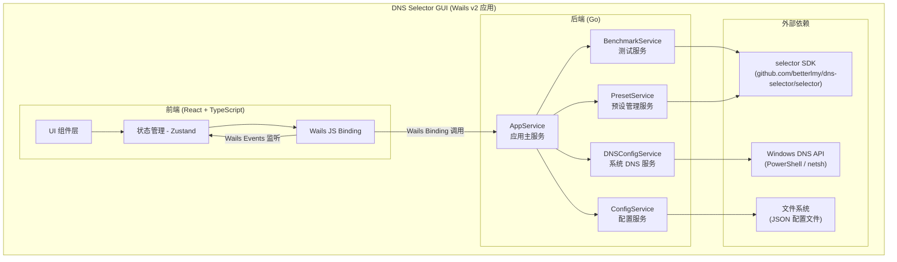

# 设计文档：DNS Selector GUI

## Overview

DNS Selector GUI 是开源 CLI 项目 [dns-selector](https://github.com/betterlmy/dns-selector) 的 Windows 可视化桌面版本。应用通过图形界面让用户测试多个 DNS 服务器（UDP/DoT/DoH）的性能，查看综合评分排名，并直接修改 Windows 系统 DNS 配置。

### 技术选型：Wails v2 + React + TypeScript

选择 **Wails v2** 作为 GUI 框架，理由如下：

1. **直接复用 selector SDK**：Wails 使用 Go 作为后端，可以直接 `import "github.com/betterlmy/dns-selector/selector"` 调用核心引擎，无需通过 CLI 二进制或 IPC 中转
2. **现代 Web 前端**：使用 React + TypeScript 构建 UI，生态成熟，组件库丰富（如 [Recharts](https://recharts.org/) 用于柱状图），CSS 方案灵活，轻松实现浅色/深色主题
3. **Windows 原生体验**：Wails v2 在 Windows 上使用 WebView2（基于 Chromium），无 CGO 依赖，支持原生窗口标题栏和系统主题检测
4. **轻量打包**：最终产物为单个 `.exe` 文件，无需安装 Node.js 或浏览器运行时（WebView2 已内置于 Windows 10/11）

### 核心设计原则

- **SDK 优先**：所有 DNS 测试逻辑通过 `selector` 包完成，GUI 层不重复实现协议处理和评分算法
- **前后端分离**：Go 后端负责业务逻辑（测试、配置、系统 DNS 修改），React 前端负责展示和交互
- **响应式 UI**：耗时操作（DNS 测试、系统 DNS 修改）在 goroutine 中执行，通过 Wails 事件机制推送进度到前端

## Architecture

### 系统架构图



### 前后端通信机制

Wails v2 提供两种通信方式，本项目均使用：

1. **Binding 调用（前端 → 后端）**：Go 结构体方法通过 Wails 自动生成 TypeScript 绑定，前端直接调用异步函数
2. **Events 事件（后端 → 前端）**：后端通过 `runtime.EventsEmit` 推送实时数据（测试进度、状态变更），前端通过 `runtime.EventsOn` 监听


## Components and Interfaces

### 后端服务层

#### 1. AppService（应用主服务）

应用的入口服务，由 Wails 框架管理生命周期。负责协调其他服务，暴露给前端的所有 Binding 方法均定义在此。

```go
// AppService 是 Wails 绑定的主服务
type AppService struct {
    ctx             context.Context
    benchmark       *BenchmarkService
    config          *ConfigService
    dnsConfig       *DNSConfigService
    preset          *PresetService
    cancelBenchmark context.CancelFunc // 用于停止测试
}

// --- 预设管理 ---
func (a *AppService) GetCurrentPreset() string
func (a *AppService) SwitchPreset(name string) error
func (a *AppService) GetServerList() []ServerInfo
func (a *AppService) GetDomainList() []DomainInfo

// --- 自定义服务器/域名管理 ---
func (a *AppService) AddCustomServer(req AddServerRequest) error
func (a *AppService) RemoveCustomServer(address string) error
func (a *AppService) AddCustomDomain(domain string) error
func (a *AppService) RemoveCustomDomain(domain string) error

// --- 测试参数 ---
func (a *AppService) GetTestParams() TestParams
func (a *AppService) SetTestParams(params TestParams) error

// --- 测试执行 ---
func (a *AppService) StartBenchmark() error   // 异步执行，通过事件推送进度
func (a *AppService) StopBenchmark() error

// --- 测试结果 ---
func (a *AppService) GetLastResults() (*TestResultsData, error)

// --- 系统 DNS ---
func (a *AppService) GetNetworkAdapters() ([]NetworkAdapterInfo, error)
func (a *AppService) ApplyDNS(adapterName string, dnsAddress string) error
func (a *AppService) RestoreDHCP(adapterName string) error
func (a *AppService) IsAdmin() bool

// --- 配置文件 ---
func (a *AppService) ImportConfig(filePath string) error
func (a *AppService) ExportConfig(filePath string) error

// --- 主题 ---
func (a *AppService) GetSystemTheme() string  // "light" | "dark"
```

#### 2. BenchmarkService（测试服务）

封装 `selector.Selector` 的调用，管理测试生命周期。

```go
type BenchmarkService struct {
    selector *selector.Selector
    running  bool
    mu       sync.Mutex
}

// RunBenchmark 执行测试，progressCb 在每次查询完成后回调
func (b *BenchmarkService) RunBenchmark(ctx context.Context, progressCb func()) ([]selector.BenchmarkResult, error)

// BuildSelector 根据当前配置构建 selector 实例
func (b *BenchmarkService) BuildSelector(servers []selector.DNSServer, domains []string, params TestParams) error

// IsRunning 返回测试是否正在执行
func (b *BenchmarkService) IsRunning() bool
```

#### 3. ConfigService（配置服务）

管理 JSON 配置文件的读写和自动保存。

```go
type ConfigService struct {
    configPath string       // 默认配置文件路径
    config     *AppConfig   // 当前配置
    mu         sync.RWMutex
}

func (c *ConfigService) Load(path string) (*AppConfig, error)
func (c *ConfigService) Save(path string) error
func (c *ConfigService) GetConfig() *AppConfig
func (c *ConfigService) UpdateConfig(config *AppConfig) error
func (c *ConfigService) GetDefaultPath() string  // %APPDATA%/dns-selector-gui/config.json
```

#### 4. DNSConfigService（系统 DNS 服务）

通过 PowerShell 命令读取和修改 Windows 系统 DNS 设置。

```go
type DNSConfigService struct{}

// GetAdapters 获取所有活动网络适配器及其 DNS 配置
func (d *DNSConfigService) GetAdapters() ([]NetworkAdapterInfo, error)
// 内部执行: Get-NetAdapter | Where-Object {$_.Status -eq 'Up'}
// 配合: Get-DnsClientServerAddress -InterfaceIndex <idx>

// SetDNS 设置指定适配器的 DNS 服务器
func (d *DNSConfigService) SetDNS(adapterName string, dnsAddress string) error
// 内部执行: Set-DnsClientServerAddress -InterfaceAlias <name> -ServerAddresses <addr>

// ResetToAuto 恢复指定适配器为 DHCP 自动获取
func (d *DNSConfigService) ResetToAuto(adapterName string) error
// 内部执行: Set-DnsClientServerAddress -InterfaceAlias <name> -ResetServerAddresses

// CheckAdmin 检查当前进程是否具有管理员权限
func (d *DNSConfigService) CheckAdmin() bool
```

#### 5. PresetService（预设管理服务）

管理预设方案和自定义服务器/域名的合并逻辑。

```go
type PresetService struct {
    currentPreset  string              // "cn" | "global"
    customServers  []selector.DNSServer
    customDomains  []string
}

// GetMergedServers 返回预设服务器 + 自定义服务器的合并列表
func (p *PresetService) GetMergedServers() []selector.DNSServer

// GetMergedDomains 返回预设域名 + 自定义域名的合并列表
func (p *PresetService) GetMergedDomains() []string

// SwitchPreset 切换预设方案，清空自定义内容
func (p *PresetService) SwitchPreset(name string) error

// AddCustomServer / RemoveCustomServer
func (p *PresetService) AddCustomServer(server selector.DNSServer) error
func (p *PresetService) RemoveCustomServer(address string) error

// AddCustomDomain / RemoveCustomDomain
func (p *PresetService) AddCustomDomain(domain string) error
func (p *PresetService) RemoveCustomDomain(domain string) error

// IsPresetItem 判断某个服务器/域名是否属于预设（不可删除）
func (p *PresetService) IsPresetItem(address string) bool
```

### 前端组件层

```
src/
├── App.tsx                    # 根组件，主题 Provider
├── store/
│   └── useAppStore.ts         # Zustand 全局状态
├── components/
│   ├── layout/
│   │   └── MainLayout.tsx     # 主窗口布局（左右分栏）
│   ├── preset/
│   │   └── PresetSelector.tsx # 预设方案切换控件
│   ├── servers/
│   │   ├── ServerList.tsx     # DNS 服务器列表
│   │   └── AddServerDialog.tsx# 添加服务器对话框
│   ├── domains/
│   │   ├── DomainList.tsx     # 测试域名列表
│   │   └── AddDomainDialog.tsx# 添加域名对话框
│   ├── params/
│   │   └── TestParamsForm.tsx # 测试参数配置表单
│   ├── benchmark/
│   │   ├── BenchmarkControl.tsx  # 开始/停止测试按钮 + 进度条
│   │   ├── ResultsTable.tsx      # 测试结果表格
│   │   ├── ScoreChart.tsx        # Score 柱状图（Recharts）
│   │   └── Recommendation.tsx    # 推荐 DNS 展示
│   ├── dns-config/
│   │   ├── CurrentDNSDisplay.tsx # 当前系统 DNS 配置展示
│   │   ├── ApplyDNSDialog.tsx    # 应用 DNS 对话框（选择网卡）
│   │   └── RestoreDHCPButton.tsx # 恢复 DHCP 按钮
│   └── config/
│       └── ConfigToolbar.tsx     # 导入/导出配置按钮
├── hooks/
│   └── useWailsEvents.ts        # Wails 事件监听 Hook
├── types/
│   └── index.ts                 # TypeScript 类型定义
└── styles/
    ├── theme.ts                 # 浅色/深色主题定义
    └── global.css               # 全局样式
```

### Wails 事件定义

| 事件名 | 方向 | 数据 | 说明 |
|--------|------|------|------|
| `benchmark:progress` | 后端→前端 | `{ completed: number, total: number, percent: number }` | 测试进度更新 |
| `benchmark:complete` | 后端→前端 | `TestResultsData` | 测试完成，携带完整结果 |
| `benchmark:error` | 后端→前端 | `{ message: string }` | 测试出错 |
| `benchmark:stopped` | 后端→前端 | `{}` | 测试被用户中断 |


## Data Models

### Go 后端数据模型

```go
// --- 请求/响应 DTO ---

// AddServerRequest 添加自定义 DNS 服务器的请求
type AddServerRequest struct {
    Protocol      string `json:"protocol"`       // "udp" | "dot" | "doh"
    Address       string `json:"address"`        // IP 地址、域名或 URL
    TLSServerName string `json:"tlsServerName"`  // 可选，DoT/DoH 的 TLS 服务器名
    BootstrapIP   string `json:"bootstrapIP"`    // 可选，DoT/DoH 的引导 IP
}

// ServerInfo 服务器列表项（前端展示用）
type ServerInfo struct {
    Name          string `json:"name"`
    Address       string `json:"address"`
    Protocol      string `json:"protocol"`       // "udp" | "dot" | "doh"
    TLSServerName string `json:"tlsServerName"`
    IsPreset      bool   `json:"isPreset"`       // 是否为预设项（不可删除）
}

// DomainInfo 域名列表项（前端展示用）
type DomainInfo struct {
    Domain   string `json:"domain"`
    IsPreset bool   `json:"isPreset"`            // 是否为预设项（不可删除）
}

// TestParams 测试参数
type TestParams struct {
    Queries     int     `json:"queries"`     // 每域名查询次数，默认 10
    Warmup      int     `json:"warmup"`      // 预热查询次数，默认 1
    Concurrency int     `json:"concurrency"` // 最大并发数，默认 20
    Timeout     float64 `json:"timeout"`     // 超时时间（秒），默认 2.0
}

// TestResultItem 单个服务器的测试结果
type TestResultItem struct {
    Name             string  `json:"name"`
    Address          string  `json:"address"`
    Protocol         string  `json:"protocol"`
    MedianLatencyMs  float64 `json:"medianLatencyMs"`
    P95LatencyMs     float64 `json:"p95LatencyMs"`
    SuccessRate      float64 `json:"successRate"`      // 0-1
    RawSuccesses     int     `json:"rawSuccesses"`
    Successes        int     `json:"successes"`
    Total            int     `json:"total"`
    AnswerMismatches int     `json:"answerMismatches"`
    Score            float64 `json:"score"`
    IsTimeout        bool    `json:"isTimeout"`        // 所有查询均超时
}

// TestResultsData 完整测试结果
type TestResultsData struct {
    Items     []TestResultItem `json:"items"`      // 按 Score 降序排列
    TestTime  string           `json:"testTime"`   // ISO 8601 时间戳
    Preset    string           `json:"preset"`     // 使用的预设方案
    BestDNS   string           `json:"bestDNS"`    // 推荐的 DNS 服务器名称
}

// NetworkAdapterInfo 网络适配器信息
type NetworkAdapterInfo struct {
    Name         string   `json:"name"`          // 适配器名称
    InterfaceIdx int      `json:"interfaceIdx"`  // 接口索引
    Status       string   `json:"status"`        // "Up" | "Down"
    CurrentDNS   []string `json:"currentDNS"`    // 当前 DNS 服务器列表
}
```

### JSON 配置文件格式（AppConfig）

```go
// AppConfig JSON 配置文件的完整结构
type AppConfig struct {
    CurrentPreset string              `json:"currentPreset"` // "cn" | "global"
    CustomServers []CustomServerEntry `json:"customServers"`
    CustomDomains []string            `json:"customDomains"`
    TestParams    TestParams          `json:"testParams"`
}

// CustomServerEntry 自定义服务器配置项
type CustomServerEntry struct {
    Protocol      string `json:"protocol"`
    Address       string `json:"address"`
    TLSServerName string `json:"tlsServerName,omitempty"`
    BootstrapIP   string `json:"bootstrapIP,omitempty"`
}
```

对应的 JSON 文件示例：

```json
{
  "currentPreset": "cn",
  "customServers": [
    {
      "protocol": "udp",
      "address": "9.9.9.9"
    },
    {
      "protocol": "doh",
      "address": "https://dns.quad9.net/dns-query",
      "tlsServerName": "dns.quad9.net"
    }
  ],
  "customDomains": [
    "example.com",
    "mysite.org"
  ],
  "testParams": {
    "queries": 10,
    "warmup": 1,
    "concurrency": 20,
    "timeout": 2.0
  }
}
```

### 测试结果持久化格式

测试结果保存在 `%APPDATA%/dns-selector-gui/last_results.json`：

```go
// PersistedResults 持久化的测试结果
type PersistedResults struct {
    Results TestResultsData `json:"results"`
    Version string          `json:"version"` // 应用版本号
}
```

### TypeScript 前端类型（由 Wails 自动生成）

Wails v2 的 `wails generate module` 命令会根据 Go 结构体自动生成对应的 TypeScript 类型定义，前端直接使用生成的类型，无需手动维护。关键类型与 Go 后端一一对应：

- `ServerInfo`、`DomainInfo` — 列表展示
- `TestParams` — 参数表单
- `TestResultItem`、`TestResultsData` — 结果展示
- `NetworkAdapterInfo` — 网卡选择对话框
- `AddServerRequest` — 添加服务器表单

### 前端状态管理（Zustand Store）

```typescript
interface AppState {
  // 预设
  currentPreset: string;
  servers: ServerInfo[];
  domains: DomainInfo[];

  // 测试参数
  testParams: TestParams;

  // 测试状态
  benchmarkRunning: boolean;
  benchmarkProgress: { completed: number; total: number; percent: number } | null;

  // 测试结果
  results: TestResultsData | null;

  // 系统 DNS
  adapters: NetworkAdapterInfo[];
  isAdmin: boolean;

  // 主题
  theme: 'light' | 'dark';
}
```


## Correctness Properties

*A property is a characteristic or behavior that should hold true across all valid executions of a system — essentially, a formal statement about what the system should do. Properties serve as the bridge between human-readable specifications and machine-verifiable correctness guarantees.*

### Property 1: 预设项不可删除

*For any* 预设方案中的 DNS 服务器或测试域名，尝试删除该项应当失败并返回错误，且服务器列表和域名列表保持不变。

**Validates: Requirements 2.6**

### Property 2: 服务器地址格式验证

*For any* 协议类型（UDP/DoT/DoH）和任意输入字符串，服务器地址验证函数应当接受该输入当且仅当它符合对应协议的有效格式：UDP 为有效 IPv4 地址，DoT 为有效域名或 "IP@TLSServerName" 格式，DoH 为有效 HTTPS URL 或 "https://IP/path@TLSServerName" 格式。

**Validates: Requirements 5.3, 5.4, 5.5, 5.6**

### Property 3: 自定义项删除缩减列表

*For any* 包含自定义服务器或自定义域名的列表，删除其中一个自定义项后，列表长度应减少 1，且该项不再出现在列表中。

**Validates: Requirements 5.7, 6.4**

### Property 4: 添加有效域名扩展列表

*For any* 有效的域名字符串，将其添加到测试域名列表后，列表长度应增加 1，且列表中应包含该域名。

**Validates: Requirements 6.2**

### Property 5: 测试参数验证

*For any* 数值输入，测试参数验证函数应当接受该输入当且仅当：queries、warmup、concurrency 为正整数，timeout 为正数。

**Validates: Requirements 7.3**

### Property 6: Score 计算公式正确性

*For any* 有效的测试指标集合（median_seconds > 0, success_rate ∈ [0,1], P95 > 0, 有效样本数 ≥ 0），Score 的计算结果应满足：当有效样本数 ≥ 5 时，Score = (1/median_seconds) × (success_rate²) × (median/P95)；当有效样本数 < 5 时，Score = (1/median_seconds) × (success_rate²)；当所有查询均超时时，Score = 0。

**Validates: Requirements 8.7, 8.8, 8.9**

### Property 7: 测试结果按 Score 降序排列且推荐最高分

*For any* 非空的测试结果列表，排序后每个元素的 Score 应大于等于其后续元素的 Score，且推荐的 DNS 服务器（bestDNS）应为 Score 最高的服务器。

**Validates: Requirements 10.2, 10.4**

### Property 8: 配置文件 JSON 序列化往返一致

*For any* 有效的 AppConfig 对象，将其序列化为 JSON 再反序列化后，应得到与原始对象等价的 AppConfig。

**Validates: Requirements 13.1, 13.2**

### Property 9: 无效配置导入被拒绝

*For any* 无效的 JSON 字符串（格式错误或包含不合法的配置值），导入函数应返回非空错误信息，且当前配置不应被修改。

**Validates: Requirements 13.5**


## Error Handling

### 错误分类与处理策略

| 错误类别 | 场景 | 处理方式 |
|---------|------|---------|
| **输入验证错误** | 无效的 IP 地址、域名、URL、测试参数 | 在输入控件旁显示红色错误提示，阻止提交 |
| **配置文件错误** | JSON 格式错误、配置项不合法、文件不存在 | 弹出错误对话框，说明具体问题；使用默认配置回退 |
| **测试执行错误** | 网络不可用、所有服务器超时 | 在测试结果区域显示错误信息；已完成的部分结果仍然展示 |
| **系统 DNS 修改错误** | 无管理员权限、适配器不存在、命令执行失败 | 弹出错误对话框，说明失败原因和建议操作 |
| **权限错误** | 修改 DNS 时缺少管理员权限 | 显示提示对话框，引导用户以管理员身份重新运行应用 |

### 错误传播机制

- Go 后端：所有服务方法返回 `error`，由 `AppService` 统一捕获并转换为前端可理解的错误消息
- Wails Binding：Go 方法返回的 `error` 会自动转换为 JavaScript 的 rejected Promise
- 前端：通过 `try/catch` 捕获 Binding 调用错误，使用 Toast 通知或对话框展示

### 关键错误场景

1. **测试中断恢复**：用户点击"停止测试"后，通过 `context.Cancel()` 取消所有进行中的 DNS 查询，已完成的查询结果保留并展示
2. **配置文件损坏恢复**：启动时检测到配置文件损坏，自动使用默认预设配置，并创建新的配置文件覆盖损坏文件
3. **PowerShell 执行失败**：捕获 `exec.Command` 的 stderr 输出，解析错误信息并翻译为用户友好的提示

## Testing Strategy

### 测试框架

- **Go 后端单元测试**：`testing` 标准库
- **Go 属性测试**：[`rapid`](https://github.com/flyingmutant/rapid)（Go 语言的 property-based testing 库）
- **前端单元测试**：Vitest + React Testing Library（可选，视开发进度）

### 属性测试（Property-Based Testing）

本项目的核心业务逻辑（输入验证、评分计算、配置序列化、列表管理）适合属性测试。每个属性测试对应设计文档中的一个 Correctness Property。

配置要求：
- 每个属性测试最少运行 **100 次迭代**
- 每个测试用注释标注对应的设计属性：`// Feature: dns-selector-gui, Property N: <property_text>`
- 使用 `rapid` 库的生成器构造随机输入

属性测试覆盖范围：
| Property | 测试目标 | 生成器 |
|----------|---------|--------|
| Property 1 | PresetService.RemoveCustomServer/Domain 对预设项的拒绝 | 随机选择预设列表中的项 |
| Property 2 | 服务器地址验证函数 | 随机协议 + 随机字符串（含有效/无效格式） |
| Property 3 | PresetService.RemoveCustomServer/Domain | 随机自定义项列表 + 随机选择一项删除 |
| Property 4 | PresetService.AddCustomDomain | 随机有效域名字符串 |
| Property 5 | TestParams 验证函数 | 随机整数和浮点数（含负数、零、极大值） |
| Property 6 | Score 计算函数 | 随机 median/P95/success_rate/样本数 |
| Property 7 | 结果排序和推荐逻辑 | 随机 TestResultItem 列表 |
| Property 8 | AppConfig JSON 序列化/反序列化 | 随机 AppConfig 对象 |
| Property 9 | 配置导入验证 | 随机无效 JSON 字符串 |

### 单元测试（Example-Based）

覆盖具体场景和集成点：
- 预设方案切换（CN → Global，Global → CN）
- 默认参数值验证
- 预设内容完整性（CN 32 服务器 + 29 域名，Global 16 服务器 + 24 域名）
- 配置文件不存在时的回退行为
- 测试结果持久化的读写

### 集成测试

需要在 Windows 环境下执行：
- DNS 协议连通性（UDP/DoT/DoH 各测试 1-2 个已知服务器）
- PowerShell 命令执行（获取网络适配器列表）
- 完整的 Benchmark 流程（使用少量服务器和域名）

### 不适用属性测试的部分

以下部分使用示例测试或手动测试：
- UI 渲染和布局（手动测试 + 可选的快照测试）
- 浅色/深色主题切换（手动测试）
- Windows 系统 DNS 修改（集成测试，需管理员权限）
- Wails 事件通信（集成测试）
